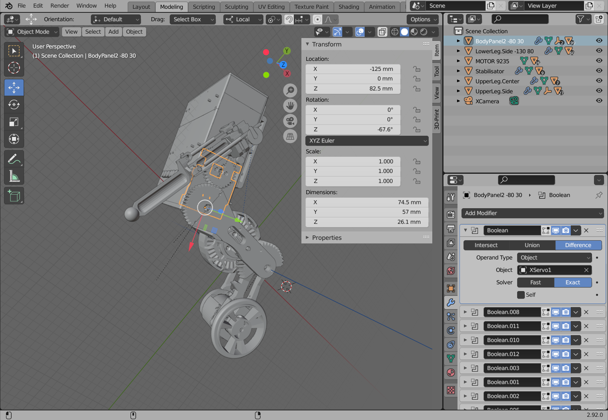


# CAD

## Overview
Here are the blender files that I used to plan the robot and to print all the parts.

`Robot.blend` contains almost all parts, except for the wheel, the arm and the encoder adapter for the foot motor. Those are in separate files. Since the robot is mostly symmetrical, I only designed the left side for most mirrored parts. Blender isn't exactly a typical CAD software, but I wanted to try it out for this project anyway and it worked quite well.

If you want to use blender to modify these files or to create your own, I recommend to install some plugins: The [blender-apply-parent-inverse](https://github.com/drewcassidy/blender-apply-parent-inverse) blender plugin allows you to reset the internal matrix blender uses in its object tree. I also used this [Blender-Gear](https://github.com/xynium/Blender-Gear) addon to create the gears. I made screenshots of the settings I used to create the gears, just in case they need to be modified (not exactly elegant, I know).

## Printing
If you just want the parts that need to be printed, I exported those in the `Meshes` folder. Some parts need to be printed double, those have `_double` in the filename. And some parts need to be printed also twice, but one time mirrored. Those have `_mirror` in the filename. Some parts need to be made out of rubber. The negative forms used to create them are here as well, they have `rubber_negative` in the filename.

In total it's about 60 parts that need to be printed. I suggest starting with the body, then the legs. When everything is working, you can add the arms. 3D printers arn't super precise, you will probably need to adjust some parts in blender if they don't fit. Some parts need to be printed with support. I used [Cura](https://ultimaker.com/de/software/ultimaker-cura/) to slice the meshes, but it probably doesn't matter which software you use for that.